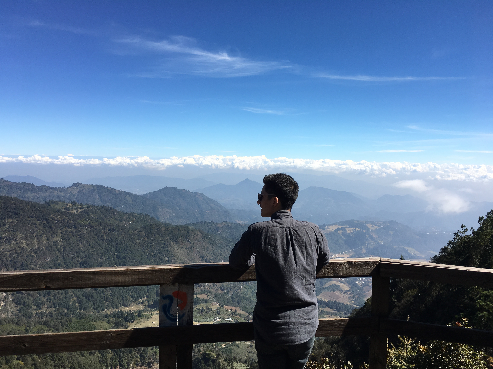

# Ángel Mendiola Ross, MCP
## Sociology Ph.D. Student, UC Berkeley

Research interests: (sub)urban sociology, housing, race/ethnicity and inequality, policing

My current project examines racial threat in suburban California. Given the suburbanization of poverty, in part due to the gentrification of the urban core, I ask: Does racial threat hold in the suburbs? And are the determinants of police spending similar in the suburbs compared with the coastal urban core?

Previous projcets been covered by [NextCity](https://nextcity.org/daily/entry/affordable-housing-renter-protests-renter-week-of-action-2017) and the [Press-Enterprise](https://www.pe.com/2020/08/01/inland-cities-spent-1-billion-on-police-ignored-poverty-study-says/).

